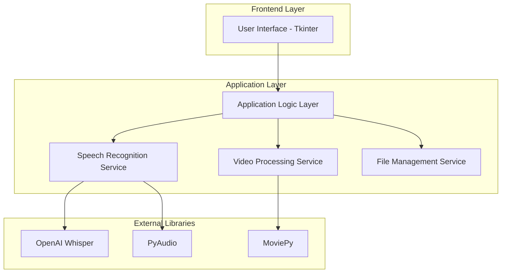
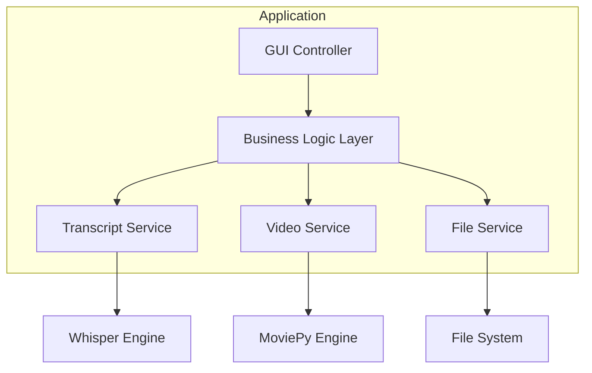
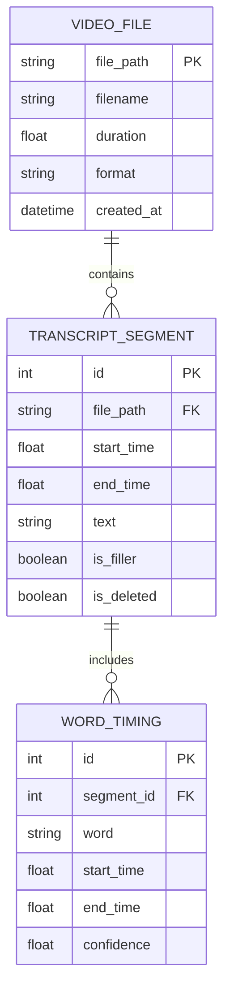

# Video Transcript Editor - Technical Architecture Document

## 1. Architecture Design



## 2. Technology Description

- Frontend: Python Tkinter (built-in GUI framework)
- Backend: Python 3.8+ with core libraries
- Speech Recognition: OpenAI Whisper for transcript generation
- Video Processing: MoviePy for video editing and trimming
- Audio Processing: PyAudio for audio extraction and analysis
- File Handling: Built-in Python os and pathlib modules

## 3. Route Definitions

As a desktop application, there are no traditional routes, but main application states:

| State | Purpose |
|-------|----------|
| /idle | Initial state, waiting for video file selection |
| /file_selected | Video file loaded, ready for transcript generation |
| /generating | Transcript generation in progress |
| /transcript_ready | Transcript available for editing |
| /processing | Video trimming and processing in progress |
| /completed | Processed video ready for download |

## 4. API Definitions

### 4.1 Core API

**File Operations**
```python
def select_video_file() -> str
```
Request: None (opens file dialog)
Response: File path string or None if cancelled

**Transcript Generation**
```python
def generate_transcript(video_path: str) -> TranscriptData
```
Request:
| Param Name | Param Type | isRequired | Description |
|------------|------------|------------|-------------|
| video_path | string | true | Path to the video file |

Response:
| Param Name | Param Type | Description |
|------------|------------|-------------|
| segments | List[TranscriptSegment] | List of transcript segments with timestamps |
| duration | float | Total video duration in seconds |

**Video Processing**
```python
def process_video(video_path: str, transcript: TranscriptData) -> str
```
Request:
| Param Name | Param Type | isRequired | Description |
|------------|------------|------------|-------------|
| video_path | string | true | Path to original video |
| transcript | TranscriptData | true | Edited transcript data |

Response:
| Param Name | Param Type | Description |
|------------|------------|-------------|
| output_path | string | Path to the processed video file |

## 5. Server Architecture Diagram



## 6. Data Model

### 6.1 Data Model Definition



### 6.2 Data Definition Language

**TranscriptSegment Class**
```python
@dataclass
class TranscriptSegment:
    id: int
    start_time: float  # seconds
    end_time: float    # seconds
    text: str
    is_filler: bool = False
    is_deleted: bool = False
    confidence: float = 0.0

@dataclass
class TranscriptData:
    segments: List[TranscriptSegment]
    duration: float
    file_path: str
    
    def get_active_segments(self) -> List[TranscriptSegment]:
        """Return segments that are not deleted"""
        return [seg for seg in self.segments if not seg.is_deleted]
    
    def detect_filler_words(self) -> None:
        """Mark segments containing filler words"""
        filler_patterns = ['uh', 'um', 'uhm', 'er', 'ah']
        for segment in self.segments:
            if any(filler in segment.text.lower() for filler in filler_patterns):
                segment.is_filler = True
```

**Configuration Settings**
```python
@dataclass
class AppConfig:
    supported_formats: List[str] = field(default_factory=lambda: ['.mp4', '.avi', '.mov', '.mkv'])
    whisper_model: str = 'base'  # tiny, base, small, medium, large
    output_format: str = 'mp4'
    silence_threshold: float = 0.01  # for detecting silent segments
    min_segment_duration: float = 0.5  # minimum segment length in seconds
    filler_words: List[str] = field(default_factory=lambda: ['uh', 'um', 'uhm', 'er', 'ah', 'like', 'you know'])
```