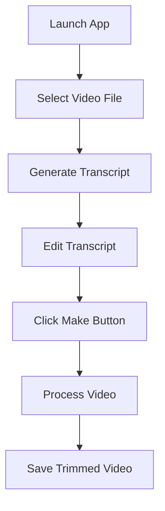

# Video Transcript Editor - Product Requirements Document

## 1. Product Overview
A simple Python desktop application that automatically generates video transcripts and allows users to edit them, then trims the original video based on the edited transcript while removing filler words and silent gaps.

The application solves the problem of manual video editing by automating transcript generation and intelligent video trimming, targeting content creators, educators, and professionals who need clean, concise video content.

## 2. Core Features

### 2.1 User Roles
No user role distinction is necessary for this application - all users have the same access and functionality.

### 2.2 Feature Module
Our video transcript editor consists of the following main pages:
1. **Main Interface**: video file selection, transcript display area, editing controls, and action buttons.
2. **Processing Status**: progress indicators for transcript generation and video processing.

### 2.3 Page Details

| Page Name | Module Name | Feature description |
|-----------|-------------|---------------------|
| Main Interface | File Selection | Browse and select video files (MP4, AVI, MOV formats) |
| Main Interface | Transcript Display | Show generated transcript in editable text area with timestamps |
| Main Interface | Transcript Editor | Edit transcript text, modify timing, delete unwanted sections |
| Main Interface | Action Controls | Generate transcript button, Make/Trim video button |
| Processing Status | Progress Indicator | Show real-time progress for transcript generation and video processing |
| Processing Status | Status Messages | Display current operation status and completion notifications |

## 3. Core Process

**Main User Flow:**
1. User opens the application
2. User selects a video file using the file browser
3. Application automatically generates transcript with timestamps
4. User reviews and edits the transcript (removes unwanted text, filler words)
5. User clicks "Make" to process the video
6. Application trims video based on edited transcript and removes silent gaps
7. User receives the processed video file

## 4. User Interface Design

### 4.1 Design Style
- **Primary Colors**: Clean blue (#2196F3) for action buttons, dark gray (#333333) for text
- **Secondary Colors**: Light gray (#F5F5F5) for backgrounds, red (#F44336) for delete actions
- **Button Style**: Rounded corners with subtle shadows, flat design approach
- **Font**: System default sans-serif, 12px for body text, 14px for headers
- **Layout Style**: Single-window layout with vertical sections, minimal and functional design
- **Icons**: Simple line icons for file operations and media controls

### 4.2 Page Design Overview

| Page Name | Module Name | UI Elements |
|-----------|-------------|-------------|
| Main Interface | File Selection | Large "Open Video" button with file icon, selected file path display |
| Main Interface | Transcript Display | Scrollable text area with monospace font, line numbers, timestamp markers |
| Main Interface | Transcript Editor | Standard text editing controls, find/replace functionality |
| Main Interface | Action Controls | Prominent "Generate Transcript" and "Make Video" buttons with loading states |
| Processing Status | Progress Indicator | Horizontal progress bar with percentage, estimated time remaining |
| Processing Status | Status Messages | Status text area with color-coded messages (info, success, error) |

### 4.3 Responsiveness
Desktop-first application designed for mouse and keyboard interaction, with minimum window size of 800x600 pixels for optimal usability.